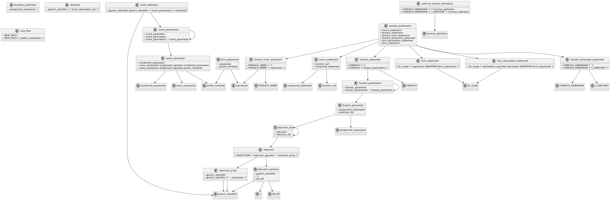

# 利用clang前端让basilisk扩展到C++调研

>本调研旨在评估basilisk的词法语法的分析过程。将其与clang的词法语法分析代码进行对比，从而对basilisk的迁移进行评估。
## 目录

- [利用clang前端让basilisk扩展到C++调研](#利用clang前端让basilisk扩展到c调研)
  - [目录](#目录)
  - [1. 词法分析](#1-词法分析)
      - [1.1 对数字识别的差别（如int类型和float类型）](#11-对数字识别的差别如int类型和float类型)
      - [1.2 开头相同的运算符解析的差别（如"%="和"%"）](#12-开头相同的运算符解析的差别如和)
      - [1.3 对普通的Identify的处理](#13-对普通的identify的处理)
      - [1.4 对特殊Identify的处理（如int,float等）](#14-对特殊identify的处理如intfloat等)
      - [1.5 对于字符串的分析方式](#15-对于字符串的分析方式)
      - [1.6 OMP(OpenMP)](#16-ompopenmp)
      - [1.7 file\_line（文件行号指示器，例如 `#line 42 "example.c"`）](#17-file_line文件行号指示器例如-line-42-examplec)
      - [1.8 宏定义（@def）](#18-宏定义def)
      - [1.9 foreach与foreach\_（basilisk中的iterators）](#19-foreach与foreach_basilisk中的iterators)
      - [1.10 部分多个词的词法分析( new vertex scalar , new face vertor , new symmetric tensor , vertex scalar , face vertor , symmetric tensor)](#110-部分多个词的词法分析-new-vertex-scalar--new-face-vertor--new-symmetric-tensor--vertex-scalar--face-vertor--symmetric-tensor)
  - [2. 语法分析](#2-语法分析)
    - [translation\_unit](#translation_unit)
      - [2.1 translation\_unit(错误处理)](#21-translation_unit错误处理)
      - [2.2 external\_declaration](#22-external_declaration)
        - [2.2.1 basilisk的扩展](#221-basilisk的扩展)
        - [2.2.2 处理function\_definition和declaration的差别](#222-处理function_definition和declaration的差别)
      - [2.3 declaration(static\_assert\_declaration)](#23-declarationstatic_assert_declaration)
      - [2.4 function\_definition](#24-function_definition)
    - [statement](#statement)
      - [2.5 compound\_statement](#25-compound_statement)
      - [2.6 selection statement(对if语句分析的差异)](#26-selection-statement对if语句分析的差异)
      - [2.7 iteration\_statement( basilisk的拓展以及分析的差异 )](#27-iteration_statement-basilisk的拓展以及分析的差异-)
      - [2.8 jump-statement( goto中对identify处理的差异 )](#28-jump-statement-goto中对identify处理的差异-)
      - [2.9 labeled-statement(对Identify处理的差异)](#29-labeled-statement对identify处理的差异)
    - [expression](#expression)
      - [2.10 assignment\_expression( basilisk的拓展 )](#210-assignment_expression-basilisk的拓展-)
      - [2.11 unary\_expression( basilisk的拓展 )](#211-unary_expression-basilisk的拓展-)
      - [2.12 postfix-expression](#212-postfix-expression)
      - [2.13 argument\_expression\_list( basilisk拓展 )](#213-argument_expression_list-basilisk拓展-)
      - [2.14 initializer-list](#214-initializer-list)
    - [basilisk extensions](#basilisk-extensions)
      - [2.15 basilisk 扩展( clang中没有，只有basilisk中的语法 )](#215-basilisk-扩展-clang中没有只有basilisk中的语法-)
        - [2.15.1 关系图](#2151-关系图)
  - [3. 流程差异](#3-流程差异)
    - [3.1 clang的前端编译过程总览](#31-clang的前端编译过程总览)
      - [3.1.1 BeginSourceFile()](#311-beginsourcefile)
      - [3.1.2 Execute()](#312-execute)
      - [3.1.3 EndSourceFile()](#313-endsourcefile)
    - [3.2 clang的AST的生成与解析的前期准备工作](#32-clang的ast的生成与解析的前期准备工作)
    - [3.3 clang的AST生成与解析](#33-clang的ast生成与解析)
    - [3.4 basilisk的AST树生成总览](#34-basilisk的ast树生成总览)
    - [3.5 clang与basilisk的AST语法树生成差异比较](#35-clang与basilisk的ast语法树生成差异比较)
      - [3.5.1 输入文件](#351-输入文件)
      - [3.5.2 AST数据结构管理](#352-ast数据结构管理)
      - [3.5.3 AST操作](#353-ast操作)


## 1. 词法分析
**参考：basilisk参考basilisk/src/ast/tokens.lex，
clang参考[lexer.cpp](https://clang.llvm.org/doxygen/Lexer_8cpp_source.html)**
#### 1.1 对数字识别的差别（如int类型和float类型）

basilisk中的数字识别分为float和integer，而clang中的数字识别是对所有的数字进行识别\
**basilisk:**
```lex
{HP}{H}+{IS}?				{ SAST(I_CONSTANT); }
{NZ}{D}*{IS}?				{ SAST(I_CONSTANT); }
"0"{O}*{IS}?				{ SAST(I_CONSTANT); }
{CP}?"'"([^'\\\n]|{ES})+"'"		{ SAST(I_CONSTANT); }

{D}+{E}{FS}?				{ SAST(F_CONSTANT); }
{D}*"."{D}+{E}?{FS}?			{ SAST(F_CONSTANT); }
{D}+"."{E}?{FS}?			{ SAST(F_CONSTANT); }
{HP}{H}+{P}{FS}?			{ SAST(F_CONSTANT); }
{HP}{H}*"."{H}+{P}{FS}?			{ SAST(F_CONSTANT); }
{HP}{H}+"."{P}{FS}?			{ SAST(F_CONSTANT); }
```
**clang:**
```cpp
  // C99 6.4.4.1: Integer Constants.
  // C99 6.4.4.2: Floating Constants.
  case '0': case '1': case '2': case '3': case '4':
  case '5': case '6': case '7': case '8': case '9':
    // Notify MIOpt that we read a non-whitespace/non-comment token.
    MIOpt.ReadToken();
    return LexNumericConstant(Result, CurPtr);
```
[返回目录](#目录)

#### 1.2 开头相同的运算符解析的差别（如"%="和"%"）

basilisk中对单个字符的运算符与多个字符的运算符采用穷举法进行词法解析，而clang是对所有第一个字符相同的运算符相同进行词法分析。\
（eg.如下图所示，basilisk的词法解析对"%="和"%"分为两种情况进行考虑，而clang对所有以"%"为开头的字符进行词法分析。其余也同理）\
**basilisk:**
```lex
"%="					{ SAST(MOD_ASSIGN); }
"%"					{ CAST(); }
```
**clang:**
```cpp
case '%':
    Char = getCharAndSize(CurPtr, SizeTmp);
    if (Char == '=') {
      Kind = tok::percentequal;
      CurPtr = ConsumeChar(CurPtr, SizeTmp, Result);
    } else if (LangOpts.Digraphs && Char == '>') {
      Kind = tok::r_brace;                             // '%>' -> '}'
      CurPtr = ConsumeChar(CurPtr, SizeTmp, Result);
    } else if (LangOpts.Digraphs && Char == ':') {
      CurPtr = ConsumeChar(CurPtr, SizeTmp, Result);
      Char = getCharAndSize(CurPtr, SizeTmp);
      if (Char == '%' && getCharAndSize(CurPtr+SizeTmp, SizeTmp2) == ':') {
        Kind = tok::hashhash;                          // '%:%:' -> '##'
        CurPtr = ConsumeChar(ConsumeChar(CurPtr, SizeTmp, Result),
                             SizeTmp2, Result);
      } else if (Char == '@' && LangOpts.MicrosoftExt) {// %:@ -> #@ -> Charize
        CurPtr = ConsumeChar(CurPtr, SizeTmp, Result);
        if (!isLexingRawMode())
          Diag(BufferPtr, diag::ext_charize_microsoft);
        Kind = tok::hashat;
      } else {                                         // '%:' -> '#'
        // We parsed a # character.  If this occurs at the start of the line,
        // it's actually the start of a preprocessing directive.  Callback to
        // the preprocessor to handle it.
        // TODO: -fpreprocessed mode??
        if (TokAtPhysicalStartOfLine && !LexingRawMode && !Is_PragmaLexer)
          goto HandleDirective;
 
        Kind = tok::hash;
      }
    } else {
      Kind = tok::percent;
    }
    break;
```
[返回目录](#目录)

#### 1.3 对普通的Identify的处理

basilisk是直接对已经构成的AST进行检索，而clang是对维护的表进行检索

**basilisk:**
basilisk对于特殊字符直接进行特殊处理。
```cpp
static int check_type (AstRoot * parse)
{
  if (parse->type_already_specified)
    return IDENTIFIER;
  
  Ast * declaration = ast_identifier_declaration (parse->stack, yytext);
  if (declaration) {
    if (ast_is_typedef (declaration))
      return TYPEDEF_NAME;
    return IDENTIFIER;
  }

  return IDENTIFIER;
}
```
**clang:**
clang通过一个符号表（symbol table）进行查询
```cpp
case 'A': case 'B': case 'C': case 'D': case 'E': case 'F': case 'G':
  case 'H': case 'I': case 'J': case 'K':    /*'L'*/case 'M': case 'N':
  case 'O': case 'P': case 'Q':    /*'R'*/case 'S': case 'T':    /*'U'*/
  case 'V': case 'W': case 'X': case 'Y': case 'Z':
  case 'a': case 'b': case 'c': case 'd': case 'e': case 'f': case 'g':
  case 'h': case 'i': case 'j': case 'k': case 'l': case 'm': case 'n':
  case 'o': case 'p': case 'q': case 'r': case 's': case 't':    /*'u'*/
  case 'v': case 'w': case 'x': case 'y': case 'z':
  case '_':
    // Notify MIOpt that we read a non-whitespace/non-comment token.
    MIOpt.ReadToken();
    return LexIdentifierContinue(Result, CurPtr);
```
Clang 中的标识符解析函数 LexIdentifierContinue 解析出标识符的整个内容后，会将该标识符交给预处理器中的 标识符表（identifier table） 进行查找：`const IdentifierInfo *II = PP->LookUpIdentifierInfo(Result)`;\
`LookUpIdentifierInfo`(Result) 会查找当前标识符是否是关键字或者是是否为已经定义的字符。\
[返回目录](#目录)

#### 1.4 对特殊Identify的处理（如int,float等）
basilisk对于每个特殊字符有单独匹配的词法分析，而clang直接对Identify进行处理，对于特殊字符（如int,float）这些标准 C/C++ 关键字会被预先加入到符号表中。Clang 通过一个称为 IdentifierTable 的结构来管理所有的标识符。这个表不仅包含变量名、函数名，还包含所有的关键字，如 int、float 等。

**basilisk:**
这些特殊的字符都有单独匹配的词法分析。
```lex
"auto"					{ SAST(AUTO); }
"break"					{ SAST(BREAK); }
"case"					{ SAST(CASE); }
"char"					{ SAST(CHAR); }
"const"					{ SAST(CONST); }
"continue"				{ SAST(CONTINUE); }
"default"				{ SAST(DEFAULT); }
"do"					{ SAST(DO); }
"double"				{ SAST(DOUBLE); }
"else"					{ SAST(ELSE); }
"enum"					{ SAST(ENUM); }
"extern"				{ SAST(EXTERN); }
"float"					{ SAST(FLOAT); }
"for"					{ SAST(FOR); }
"goto"					{ SAST(GOTO); }
"if"					{ SAST(IF); }
"inline"				{ SAST(INLINE); }
"int"					{ SAST(INT); }
"long"					{ SAST(LONG); }
"register"				{ SAST(REGISTER); }
"restrict"				{ SAST(RESTRICT); }
"return"				{ SAST(RETURN); }
"short"					{ SAST(SHORT); }
"signed"				{ SAST(SIGNED); }
"sizeof"				{ SAST(SIZEOF); }
"static"				{ SAST(STATIC); }
"struct"				{ SAST(STRUCT); }
"switch"				{ SAST(SWITCH); }
"typedef"				{ SAST(TYPEDEF); }
"union"					{ SAST(UNION); }
"unsigned"				{ SAST(UNSIGNED); }
"void"					{ SAST(VOID); }
"volatile"				{ SAST(VOLATILE); }
"while"					{ SAST(WHILE); }
......
```
**clang:**\
当 Clang 的词法分析器遇到类似 int、float 这样的关键字时，它会调用 LookUpIdentifierInfo() 函数，查询符号表中的条目。这个函数会返回一个 IdentifierInfo 对象，该对象包含标识符的相关信息，如它是否是一个关键字、是否是 typedef、是否是宏等。(见[1.3 对普通的Identify的处理](#13-对普通的identify的处理))\
[返回目录](#目录)

#### 1.5 对于字符串的分析方式
总体来说，在字符串分析方面两者分析步骤差异不大\
但是basilisk通过在字符串中标注u/U/L等来表示字符编码方式，对整体的字符串进行分析，而clang是读入前缀如u/U/L，再根据下一个字符是否为"进行分析\
**basilisk:**\
前缀种类 包括 u8、u、U 和 L，它们分别表示 UTF-8、UTF-16、UTF-32 和宽字符字符串字面量。
```lex
SP  (u8|u|U|L)
({SP}?\"([^"\\\n]|{ES})*\"{WS}*)+	{ SAST(STRING_LITERAL); }
```
**clang:**\
clang只对以"开头的字符串进行单独举例，其余都是在以前缀为开头的字符串的case里进行分析,作为一个参数在`bool Lexer::LexStringLiteral(Token &Result, const char *CurPtr,
                             tok::TokenKind Kind)`的最后一个参数中显示。\
eg:
```cpp
  // Identifier (e.g., uber), or
  // UTF-8 (C23/C++17) or UTF-16 (C11/C++11) character literal, or
  // UTF-8 or UTF-16 string literal (C11/C++11).
  case 'u':
    // Notify MIOpt that we read a non-whitespace/non-comment token.
    MIOpt.ReadToken();
 
    if (LangOpts.CPlusPlus11 || LangOpts.C11) {
      Char = getCharAndSize(CurPtr, SizeTmp);
 
      // UTF-16 string literal
      if (Char == '"')
        return LexStringLiteral(Result, ConsumeChar(CurPtr, SizeTmp, Result),
                                tok::utf16_string_literal);

 
      if (Char == '8') {
        char Char2 = getCharAndSize(CurPtr + SizeTmp, SizeTmp2);
 
        // UTF-8 string literal
        if (Char2 == '"')
          return LexStringLiteral(Result,
                               ConsumeChar(ConsumeChar(CurPtr, SizeTmp, Result),
                                           SizeTmp2, Result),
                               tok::utf8_string_literal);

  case 'U': // Identifier (e.g. Uber) or C11/C++11 UTF-32 string literal
    // Notify MIOpt that we read a non-whitespace/non-comment token.
    MIOpt.ReadToken();
 
    if (LangOpts.CPlusPlus11 || LangOpts.C11) {
      Char = getCharAndSize(CurPtr, SizeTmp);
 
      // UTF-32 string literal
      if (Char == '"')
        return LexStringLiteral(Result, ConsumeChar(CurPtr, SizeTmp, Result),
                                tok::utf32_string_literal);
 
      // UTF-32 character constant
      if (Char == '\'')
        return LexCharConstant(Result, ConsumeChar(CurPtr, SizeTmp, Result),
                               tok::utf32_char_constant);
 
      // UTF-32 raw string literal
      if (Char == 'R' && LangOpts.RawStringLiterals &&
          getCharAndSize(CurPtr + SizeTmp, SizeTmp2) == '"')
        return LexRawStringLiteral(Result,
                               ConsumeChar(ConsumeChar(CurPtr, SizeTmp, Result),
                                           SizeTmp2, Result),
                               tok::utf32_string_literal);
    }
```
[返回目录](#目录)
#### 1.6 OMP(OpenMP)
在basilisk的GPU中找到下面一段话：\
`Note that this could even be implemented just as a new definition of the macros OMP_PARALLEL(), OMP() and OMP_END_PARALLEL(). However, as pointed out in the blog, without some control of data layout, performance would probably be terrible.`\
猜测OMP是用于并行计算的函数，因此对于OMP的解析只需要检查括号的配对，但是不能用正规式来表达括号配对，
于是在Lex中写了一个函数进行检验，这样就实现了对以OMP为开头的这些函数的分析。
```lex
^[ \t]*OMP[ \t]*\(	                { ompreproc(); }
"__attribute__"{WS}*\(                  { ompreproc(); }

static void ompreproc (void)
{
  int c, scope = 1;
  while ((c = input()) != 0) {
    if (c == '(')
      scope++;
    else if (c == ')') {
      scope--;
      if (scope == 0)
	return;
    }
  }
  //  yyerror ("unterminated OMP");
}
```
相比于 Clang 对 OpenMP 的复杂处理，Basilisk C 采用了一种更简化的方式，可能basilisk只有这样的一种写法。\

[返回目录](#目录)

#### 1.7 file_line（文件行号指示器，例如 `#line 42 "example.c"`）
basilisk中对行号指示器处理的比较简单，file_line() 函数解析这些行号指示器，并将行号和文件名信息存储到相应的结构中。这个机制在处理预处理器生成的文件时非常有用，因为它允许跟踪文件的源代码位置，特别是在宏展开或文件包含的情况下。\
```lex
^[ \t]*#[ \t]+[0-9]+[ \t]+{STRING}.*    { file_line (parse, yytext); }

static void file_line (AstRoot * parse, const char * text)
{
  char * s = strchr (text, '#') + 1;
  yylineno = atoi(s) - 1;
  s = strchr (s, '"') + 1;
  char * end = strchr (s, '"');
  parse->file = allocate (parse->alloc, end - s + 1);
  strncpy ((char *) parse->file, s, end - s);
  //  fprintf (stderr, "%s: \"%s\" %d\n", text, file, yylineno);
}
```
[返回目录](#目录)


#### 1.8 宏定义（@def）
在 Basilisk C 中，使用 @def 来定义复杂的宏结构。最后需要检测`@def ... @`。\
因此Lex中的检测部分是这样的：
```lex
^[ \t]*@[ \t]*def[ \t].*                { bpreproc(); }

static void bpreproc (void)
{
  int c;
  while ((c = input()) != 0)
    if (c == '@')
      return;
  //  yyerror ("unterminated @def");
}
```
这与C语言中定义宏的方式不同，Clang 的预处理器处理 #define、#include、#pragma 等标准预处理指令，而不像 Basilisk C 通过 @def 这样的自定义语法来处理预处理指令。\
[返回目录](#目录)

#### 1.9 foreach与foreach_（basilisk中的iterators）
Basilisk C 的 foreach 是一种特定于该语言的控制结构，用于遍历网格中的单元、维度或邻居。在 Basilisk C 的词法分析器中，通过正则表达式识别不同形式的 foreach，然后根据不同的遍历需求生成相应的 Token。\
这与clang的词法分析不同，clang对所有首字母相同的进行分析，再进行分类，而且clang没有以foreach_{L}{A}*(foreach_+Identify)的用法。倘若有也只有类似`foreach Identify`的用法，clang不会特意为特定前缀（如 foreach_）做专门的处理。\
**basilisk:**
```lex
"foreach_blockf" |
"foreach_block" |
"foreach_child" |
"foreach_neighbor"                      { SAST(FOREACH_INNER); }

"foreach_dimension"			{ SAST(FOREACH_DIMENSION); }

"foreach" |
"foreach_"{L}{A}*                       { SAST(FOREACH); }
```
**clang:**\
clang中只有对以f开头的标识符进行整体分析。同时并没有同一前缀进行专门处理。
clang的Indentify处理函数`bool Lexer::LexIdentifierContinue(Token &Result, const char *CurPtr)`中只有对特殊的Identify进行识别。
```cpp
// C99 6.4.2: Identifiers.
  case 'A': case 'B': case 'C': case 'D': case 'E': case 'F': case 'G':
  case 'H': case 'I': case 'J': case 'K':    /*'L'*/case 'M': case 'N':
  case 'O': case 'P': case 'Q':    /*'R'*/case 'S': case 'T':    /*'U'*/
  case 'V': case 'W': case 'X': case 'Y': case 'Z':
  case 'a': case 'b': case 'c': case 'd': case 'e': case 'f': case 'g':
  case 'h': case 'i': case 'j': case 'k': case 'l': case 'm': case 'n':
  case 'o': case 'p': case 'q': case 'r': case 's': case 't':    /*'u'*/
  case 'v': case 'w': case 'x': case 'y': case 'z':
  case '_':
    // Notify MIOpt that we read a non-whitespace/non-comment token.
    MIOpt.ReadToken();
    return LexIdentifierContinue(Result, CurPtr);
```
[返回目录](#目录)


#### 1.10 部分多个词的词法分析( new vertex scalar , new face vertor , new symmetric tensor , vertex scalar , face vertor , symmetric tensor)
basilisk通过正则表达式对这些进行识别，而clang在词法分析只是单独处理每个词(利用switch case对每个词的首字母进行分别处理)，在语法分析部分再整体处理这些词。\
这与basilisk的组合少，clang的new组合多有关。\
**basilisk:**
```lex
"new"{WS}+("vertex"{WS}+)?"scalar"      { SAST(NEW_FIELD); }
"new"{WS}+("face"{WS}+)?"vector"        { SAST(NEW_FIELD); }
"new"{WS}+("symmetric"{WS}+)?"tensor"   { SAST(NEW_FIELD); }
"vertex"{WS}+"scalar"                   { SAST(TYPEDEF_NAME); }
"face"{WS}+"vector"                     { SAST(TYPEDEF_NAME); }
"symmetric"{WS}+"tensor"                { SAST(TYPEDEF_NAME); }
```
[返回目录](#目录)


## 2. 语法分析
**对basilisk主要参考文件为basilisk/src/ast/yacc。\
对clang主要参考文件夹为[Parse](https://clang.llvm.org/doxygen/dir_56d2d57cdd4ff12ce93058b4ec37b8e1.html)。\
主要对[Parse.cpp](https://clang.llvm.org/doxygen/Parse_2Parser_8cpp_source.html),[ParseStmt.cpp](https://clang.llvm.org/doxygen/ParseStmt_8cpp_source.html)
[ParseExpr.cpp](https://clang.llvm.org/doxygen/ParseExpr_8cpp_source.html)
等文件进行参考。**\

[返回目录](#目录)

### translation_unit

#### 2.1 translation_unit(错误处理)
相比于clang，basilisk添加了错误处理的部分，在clang中存在错误恢复函数(如`static bool HasFlagsSet(Parser::SkipUntilFlags L, Parser::SkipUntilFlags R)`)，错误检测函数(如`Diag(Tok, diag::err_expected_semi_after_statement);`)，对错误有一定的处理能力(如`bool Parser::SkipUntil(ArrayRef<tok::TokenKind> Toks, SkipUntilFlags Flags)`)，且clang对错误的分类较多，因此没有放在语法分析之中。\
**basilisk:**
```yacc
translation_unit
        : external_declaration
	| translation_unit external_declaration	
        | translation_unit error ';'  { $2->sym = YYSYMBOL_YYerror; }
        | translation_unit error '}'  { $2->sym = YYSYMBOL_YYerror; }
        | translation_unit error ')'  { $2->sym = YYSYMBOL_YYerror; }
        ;
```
**clang:**
```cpp
///   translation-unit:
/// [C]     external-declaration
/// [C]     translation-unit external-declaration
```
[返回目录](#目录)

#### 2.2 external_declaration
##### 2.2.1 basilisk的扩展
相比于clang的external_declaration,basilisk的一些解析更加简单，同时也加上了一些basilisk c特殊的部分。
**basilisk:**
```yacc
  external_declaration
	: function_definition
	| declaration
	| macro_statement /* Basilisk C extension */
	| event_definition /* Basilisk C extension */
	| boundary_definition /* Basilisk C extension */
	| external_foreach_dimension /* Basilisk C extension */
	| attribute /* Basilisk C extension */
	| error compound_statement              { $1->sym = YYSYMBOL_YYerror; }
	;
```
##### 2.2.2 处理function_definition和declaration的差别
在external_declaration中，clang并没有把二者分开处理，而basilisk把二者分开识别处理。\
最后在`Parser::DeclGroupPtrTy Parser::ParseDeclOrFunctionDefInternal`中通过识别tokens来识别不同。\
**basilisk:**
```yacc
external_declaration
	: function_definition
	| declaration
```
**clang:**
```cpp
// We can't tell whether this is a function-definition or declaration yet.
    if (!SingleDecl)
      return ParseDeclarationOrFunctionDefinition(Attrs, DeclSpecAttrs, DS);
  }
```
[返回目录](#目录)

#### 2.3 declaration(static_assert_declaration)
在declaration中，basilisk把static_assert_declaration加入语法分析，而clang没有。\
clang对static_assert_declaration的定义在`Parser::ParseExternalDeclaration(ParsedAttributes &Attrs,
                                 ParsedAttributes &DeclSpecAttrs,
                                 ParsingDeclSpec *DS)`中。\
**basilisk:**
```yacc
declaration
        : declaration_specifiers ';' type_not_specified                        { ast_push_declaration (parse->stack, $$); }
	| declaration_specifiers init_declarator_list ';' type_not_specified   { ast_push_declaration (parse->stack, $$); }
	| static_assert_declaration
	;
```
**clang:**
```cpp
///       declaration: [C99 6.7]
///         declaration-specifiers init-declarator-list[opt] ';'
```
```cpp
Parser::ParseExternalDeclaration(ParsedAttributes &Attrs,
                                 ParsedAttributes &DeclSpecAttrs,
                                 ParsingDeclSpec *DS) {
  DestroyTemplateIdAnnotationsRAIIObj CleanupRAII(*this);
  ParenBraceBracketBalancer BalancerRAIIObj(*this);
 
  if (PP.isCodeCompletionReached()) {
    cutOffParsing();
    return nullptr;
  }
 
  Decl *SingleDecl = nullptr;
  switch (Tok.getKind()) {
  ......
  case tok::kw_static_assert:
  case tok::kw__Static_assert:
    // A function definition cannot start with any of these keywords.
    {
      SourceLocation DeclEnd;
      return ParseDeclaration(DeclaratorContext::File, DeclEnd, Attrs,
                              DeclSpecAttrs);
    }
```
[返回目录](#目录)

#### 2.4 function_definition
basilisk和clang的语法分析不同，见下：\
**basilisk:**
```yacc
function_declaration
        : declaration_specifiers declarator { ast_push_function_definition (parse->stack, $2);  }
	;
	
function_definition
        : function_declaration declaration_list compound_statement
```
**clang:**
```cpp
///       function-definition: [C99 6.9.1]
///         decl-specs      declarator declaration-list[opt] compound-statement
```
可见，basilisk把declaration_specifiers declarator合并成function_declaration处理，是为了方便对AST栈进行操作。\
而clang并没有把这两个语法集中处理，而是直接使用decl-specs declarator这一语法。\
[返回目录](#目录)

### statement
#### 2.5 compound_statement
basilisk相比于clang的语法分析少了label-declaration\
**basilisk:**
```yacc
compound_statement
	: '{' '}'
	|
	'{'                { stack_push (parse->stack, &($1)); $$->sym = YYSYMBOL_YYUNDEF; }
	block_item_list
	'}'	           { ast_pop_scope (parse->stack, $1); }
	;
```
**clang:**
```cpp
///       compound-statement: [C99 6.8.2]
///         { block-item-list[opt] }
/// [GNU]   { label-declarations block-item-list } [TODO]
```
[返回目录](#目录)

#### 2.6 selection statement(对if语句分析的差异)
basilisk相比于clang分析更简单，并没有对if语句进行多种情况考虑。clang多使用了if-statement的语法，从而使得clang的分析更加全面。\
同时basilisk中包含了expression_error语法，该语法在分析的同时加入了错误情况的分析。\
**basilisk:**
```yacc
selection_statement
        : IF '(' expression_error ')' statement ELSE statement
        | IF '(' expression_error ')' statement
	| SWITCH '(' expression_error ')' statement
	;

  expression_error
        : expression
	| error         { $1->sym = YYSYMBOL_YYerror; }
	;
```
**clang:**
```cpp
/// selection-statement:
///         if-statement
///         switch-statement

/// ParseIfStatement
///       if-statement: [C99 6.8.4.1]
///         'if' '(' expression ')' statement
///         'if' '(' expression ')' statement 'else' statement
/// [C++]   'if' '(' condition ')' statement
/// [C++]   'if' '(' condition ')' statement 'else' statement
/// [C++23] 'if' '!' [opt] consteval compound-statement
/// [C++23] 'if' '!' [opt] consteval compound-statement 'else' statement
///
```
[返回目录](#目录)

#### 2.7 iteration_statement( basilisk的拓展以及分析的差异 )
由于basilisk有不同于普通cpp的for的表达式，因此iteration_statement中在添加了这些语法分析。\
同时basilisk对单独的字符for进行分析,目的是更好对AST语法树进行操作。\
对于for的语法分析，basilisk分为三种情况进行处理，而clang先在for-statement识别for进行集体处理，然后再分开为各种情况进行处理。
**basilisk:**
```yacc
iteration_statement
        : WHILE '(' expression ')' statement                                            
	| DO statement WHILE '(' expression ')' ';'
	| for_scope '(' expression_statement expression_statement ')' statement
	            { ast_pop_scope (parse->stack, $1); }
	| for_scope '(' expression_statement expression_statement expression ')' statement
		    { ast_pop_scope (parse->stack, $1); }
	| for_declaration_statement
	;

for_declaration_statement
        : for_scope '(' declaration expression_statement ')' statement
	            { ast_pop_scope (parse->stack, $1); }	
	| for_scope '(' declaration expression_statement expression ')' statement
	            { ast_pop_scope (parse->stack, $1); }	
	;
```
**clang:**
```cpp
/// iteration-statement:
///         while-statement
///         do-statement
///         for-statement

/// ParseForStatement
///       for-statement: [C99 6.8.5.3]
///         'for' '(' expr[opt] ';' expr[opt] ';' expr[opt] ')' statement
///         'for' '(' declaration expr[opt] ';' expr[opt] ')' statement
/// [C++]   'for' '(' for-init-statement condition[opt] ';' expression[opt] ')'
/// [C++]       statement
/// [C++0x] 'for'
///             'co_await'[opt]    [Coroutines]
///             '(' for-range-declaration ':' for-range-initializer ')'
///             statement
/// [OBJC2] 'for' '(' declaration 'in' expr ')' statement
/// [OBJC2] 'for' '(' expr 'in' expr ')' statement
///
/// [C++] for-init-statement:
/// [C++]   expression-statement
/// [C++]   simple-declaration
/// [C++23] alias-declaration
///
/// [C++0x] for-range-declaration:
/// [C++0x]   attribute-specifier-seq[opt] type-specifier-seq declarator
/// [C++0x] for-range-initializer:
/// [C++0x]   expression
/// [C++0x]   braced-init-list            [TODO]
```
[返回目录](#目录)

#### 2.8 jump-statement( goto中对identify处理的差异 )
在对jump-statement的语法分析中，basilisk由于相比于clang多了`"vertex"{WS}+"scalar"`、`"face"{WS}+"vector"`、`"symmetric"{WS}+"tensor"`，在goto语句中需要对上述词进行识别。
因此basilisk会多出对上述这些词(`TYPEDEF_NAME`)的分析。而`TYPEDEF_NAME`和`IDENTIFIER`统一为`generic_identifier`处理。\
**basilisk:**
```yacc
jump_statement
        : GOTO generic_identifier ';'
	| CONTINUE ';'
	| BREAK ';'
	| RETURN ';'
	| RETURN expression ';'
	;

generic_identifier
        : IDENTIFIER
	| TYPEDEF_NAME
	;
```
```lex
"vertex"{WS}+"scalar"                   { SAST(TYPEDEF_NAME); }
"face"{WS}+"vector"                     { SAST(TYPEDEF_NAME); }
"symmetric"{WS}+"tensor"                { SAST(TYPEDEF_NAME); }
```
[返回目录](#目录)

#### 2.9 labeled-statement(对Identify处理的差异)
差异原因与[2.8 jump-statement( goto中对identify处理的差异 )](#28-jump-statement-goto中对identify处理的差异-)相同，即basilisk由于相比于clang多了`"vertex"{WS}+"scalar"`、`"face"{WS}+"vector"`、`"symmetric"{WS}+"tensor"`，在goto语句中需要对上述词进行识别。
因此basilisk会多出对上述这些词(`TYPEDEF_NAME`)的分析。而`TYPEDEF_NAME`和`IDENTIFIER`统一为`generic_identifier`处理。\
**basilisk:**
```yacc
labeled_statement
	: generic_identifier ':' statement
	| CASE constant_expression ':' statement
	| DEFAULT ':' statement
	;

generic_identifier
        : IDENTIFIER
	| TYPEDEF_NAME
	;
```
**clang:**
```cpp
///       labeled-statement:
///         identifier ':' statement
///         'case' constant-expression ':' statement
///         'default' ':' statement
```
[返回目录](#目录)

**clang:**
```cpp
///       jump-statement:
///         'goto' identifier ';'
///         'continue' ';'
///         'break' ';'
///         'return' expression[opt] ';'
/// [GNU]   'goto' '*' expression ';'
```
[返回目录](#目录)

### expression

#### 2.10 assignment_expression( basilisk的拓展 )
basilisk有单独的 `postfix_initializer`语法和`TYPEDEF_NAME`词法，因此相比于clang，basilisk在assignment_expression有更多的语法分析。
**basilisk:**
```yacc
assignment_expression
	: conditional_expression
	| unary_expression assignment_operator assignment_expression
	| unary_expression assignment_operator postfix_initializer /* Basilisk C extension */
	| TYPEDEF_NAME assignment_operator assignment_expression /* Basilisk C extension */
	| TYPEDEF_NAME assignment_operator postfix_initializer /* Basilisk C extension */
	;
```
**clang:**
```cpp
///       assignment-expression: [C99 6.5.16]
///         conditional-expression
///         unary-expression assignment-operator assignment-expression
/// [C++]   throw-expression [C++ 15]
```
[返回目录](#目录)

#### 2.11 unary_expression( basilisk的拓展 )
basilisk拥有单独的`new_field`语法，因此相比于clang，basilisk在unary_expression中有更多的语法分析。
```yacc
unary_expression
	: postfix_expression
	| INC_OP unary_expression
	| DEC_OP unary_expression
	| unary_operator cast_expression
	| SIZEOF unary_expression
	| SIZEOF '(' type_name ')'
	| ALIGNOF '(' type_name ')'
	| new_field /* Basilisk C extension */
	;

new_field
        : NEW_FIELD
	| NEW_FIELD '[' postfix_expression ']'
	;
```
**clang:**
```cpp
///       unary-expression:  [C99 6.5.3]
///         postfix-expression
///         '++' unary-expression
///         '--' unary-expression
/// [Coro]  'co_await' cast-expression
///         unary-operator cast-expression
///         'sizeof' unary-expression
///         'sizeof' '(' type-name ')'
/// [C++11] 'sizeof' '...' '(' identifier ')'
/// [GNU]   '__alignof' unary-expression
/// [GNU]   '__alignof' '(' type-name ')'
/// [C11]   '_Alignof' '(' type-name ')'
/// [C++11] 'alignof' '(' type-id ')'
/// [GNU]   '&&' identifier
/// [C++11] 'noexcept' '(' expression ')' [C++11 5.3.7]
/// [C++]   new-expression
/// [C++]   delete-expression
```
[返回目录](#目录)

#### 2.12 postfix-expression
basilisk在postfix-expression中相比于clang多了`function_call`(包含了clang中的postfix-expression '(' argument-expression-list[opt] '))和`array_access`(basilisk的拓展)这两个语法。
**basilisk:**
```yacc
postfix_expression
	: primary_expression
	| function_call
	| array_access
        | postfix_expression '.' member_identifier
        | postfix_expression PTR_OP member_identifier
	| postfix_expression INC_OP
	| postfix_expression DEC_OP
	| '(' type_name ')' postfix_initializer
	;

function_call
        : postfix_expression '(' ')'
	| postfix_expression '(' argument_expression_list ')'
        ;

array_access
        : postfix_expression '[' ']' /* Basilisk C extension */
	| postfix_expression '[' '*' ']' /* Basilisk C extension */
        | postfix_expression '[' expression ']'
```
**clang:**
```cpp
///       postfix-expression: [C99 6.5.2]
///         primary-expression
///         postfix-expression '[' expression ']'
///         postfix-expression '[' braced-init-list ']'
///         postfix-expression '[' expression-list [opt] ']'  [C++23 12.4.5]
///         postfix-expression '(' argument-expression-list[opt] ')'
///         postfix-expression '.' identifier
///         postfix-expression '->' identifier
///         postfix-expression '++'
///         postfix-expression '--'
///         '(' type-name ')' '{' initializer-list '}'
///         '(' type-name ')' '{' initializer-list ',' '}'
```
[返回目录](#目录)

#### 2.13 argument_expression_list( basilisk拓展 )
basilisk相比于clang的语法分析中`argument_expression_list_item`不同，通过分析语法，是basilisk的扩展，且basilisk多了`argument_expression_list ','`的语法分析。
**basilisk:**
```yacc
argument_expression_list
	: argument_expression_list_item
	| argument_expression_list ',' argument_expression_list_item
	| argument_expression_list ',' /* Basilisk C extension */
	;

argument_expression_list_item
        : assignment_expression
	| postfix_initializer /* Basilisk C extension */
	;
```
**clang:**
```cpp
///       argument-expression-list:
///         assignment-expression
///         argument-expression-list , assignment-expression
```
[返回目录](#目录)

#### 2.14 initializer-list
相比于clang，basilisk对语法有一些限制，同时也有basilisk的一些扩展。可见如下分析：\
**basilisk:**
```yacc
initializer_list
	: designation initializer
	| initializer
	| initializer_list ',' designation initializer
	| initializer_list ',' initializer
	;

designation
	: designator_list '='
	;

designator_list
	: designator
	| designator_list designator
	;

designator
	: '[' constant_expression ']'
	| '.' generic_identifier
	;

constant_expression
	: conditional_expression	/* with constraints */
	;

generic_identifier
        : IDENTIFIER
	| TYPEDEF_NAME
	;
```
**clang:**
```cpp
/// [C++0x] initializer-list
/// [C++0x]   initializer-clause ...[opt]
/// [C++0x]   initializer-list , initializer-clause ...[opt]
///
/// [C++0x] initializer-clause:
/// [C++0x]   assignment-expression
/// [C++0x]   braced-init-list
```
clang对所有的assignment-expression都可以进行分析，而basilisk对有一定限制的conditional_expression分析。\
basilisk还多了`'.' generic_identifier`的语法分析，这是basilisk(对词法TYPEDEF_NAME)的扩展。\
[返回目录](#目录)


### basilisk extensions

#### 2.15 basilisk 扩展( clang中没有，只有basilisk中的语法 )

##### 2.15.1 关系图
下面是Basilisk C grammar extensions 的语法关系图。\
[点击查看高清大图](picture/basilisk_puml.png)
\
[返回目录](#目录)

## 3. 流程差异

### 3.1 clang的前端编译过程总览
主要参考文件：[FrontedAction.cpp](https://clang.llvm.org/doxygen/FrontendAction_8cpp_source.html)。
前端主要步骤可以分为三个函数:\
`bool FrontendAction::BeginSourceFile`->`llvm::Error FrontendAction::Execute()`->`void FrontendAction::EndSourceFile()`\
这三个函数联合起来处理了源文件从开始到结束的整个编译过程的前端阶段。\
可以认为，BeginSourceFile() 和 EndSourceFile() 主要是作为过程的 入口 和 出口，而 Execute() 则是处理编译任务的 核心。
#### 3.1.1 BeginSourceFile()
这个函数是 开始处理源文件 的阶段，它的主要作用是为编译过程中的源文件创建和初始化必需的上下文对象。它的功能包括：
配置编译器实例（CompilerInstance）。\
初始化并设置相关的语言选项（如目标平台、语言等）。\
初始化 Preprocessor，ASTContext 和 Sema（语义分析器）等对象。\
根据需要设置其它的编译器设置（比如是否支持代码补全等）。
\
**目标：** 初始化源文件的处理，并为后续的代码解析、语义检查做准备。

在 Clang 中，BeginSourceFile 是开始编译一个源文件时的准备阶段。

#### 3.1.2 Execute()
这个函数是整个前端编译过程中的 核心，它负责执行实际的编译任务，包括源代码的解析、生成 AST 以及其他关键步骤。它的工作包括：

如果启用了计时器，则会在执行编译时计算时间。\
调用 ExecuteAction() 执行具体的编译任务，ExecuteAction() 中会调用 ParseAST() 等方法来解析源代码并生成 AST。\
在解析并生成 AST 后，它还可能进行一些额外的处理，例如构建全局模块索引等。\
\
**目标**： 进行源代码的实际处理，包括解析、生成 AST 以及一些额外的处理。

这也是 Clang 前端处理的主要部分，它会根据不同的前端操作（比如生成中间表示、语法检查、错误报告等）调用不同的行为。

#### 3.1.3 EndSourceFile()
这个函数是 源文件处理的结束阶段，它负责在源文件处理完成后进行清理和资源释放。它的工作包括：

完成 AST 生成和相关的数据结构处理。\
可能会进行后续的代码生成或错误报告。\
清理和释放与源文件相关的资源（如文件句柄、内存等）。\
**目标**： 完成源文件的处理，执行清理工作，准备进入下一个源文件的处理（如果有的话）。

[返回目录](#目录)

### 3.2 clang的AST的生成与解析的前期准备工作
AST的生成与解析主要是在`Execute()`函数中调用的`ExecuteAction()`,而函数`void ASTFrontendAction::ExecuteAction()`是`Executeaction()`的子类。\
在解析AST的前期准备工作有：\
1.检查是否有预处理器`Preprocessor`\
2.设立用于处理递归深度过大的回退机制的方法，防止栈溢出。`noteBottomOfStack()`。\
3.如果支持代码补全，设立代码补全consumer`CodeCompletionConsumer`\
4.如果 `Sema（语法分析器）`还没有创建，调用 `CI.createSema()` 来创建 `Sema` 实例。`getTranslationUnitKind()` 获取当前翻译单元的类型，`CompletionConsumer` 传递给 `Sema` 用于代码补全功能。\
之后就可以进行AST的生成与解析。
```cpp
void ASTFrontendAction::ExecuteAction() {
  CompilerInstance &CI = getCompilerInstance();
  if (!CI.hasPreprocessor())
    return;
  // This is a fallback: If the client forgets to invoke this, we mark the
  // current stack as the bottom. Though not optimal, this could help prevent
  // stack overflow during deep recursion.
  clang::noteBottomOfStack();
 
  // FIXME: Move the truncation aspect of this into Sema, we delayed this till
  // here so the source manager would be initialized.
  if (hasCodeCompletionSupport() &&
      !CI.getFrontendOpts().CodeCompletionAt.FileName.empty())
    CI.createCodeCompletionConsumer();
 
  // Use a code completion consumer?
  CodeCompleteConsumer *CompletionConsumer = nullptr;
  if (CI.hasCodeCompletionConsumer())
    CompletionConsumer = &CI.getCodeCompletionConsumer();
 
  if (!CI.hasSema())
    CI.createSema(getTranslationUnitKind(), CompletionConsumer);
 
  ParseAST(CI.getSema(), CI.getFrontendOpts().ShowStats,
           CI.getFrontendOpts().SkipFunctionBodies);
}
```
[返回目录](#目录)

### 3.3 clang的AST生成与解析
AST的生成与解析在`ParseAST`函数。函数在[ParseAST.cpp](https://clang.llvm.org/doxygen/ParseAST_8cpp_source.html#l00100)中。\
以下是解析的流程。\
1、创建一个Sema实例。`Sema`用于执行语法分析和AST生成工作。在编译器的前端中，Sema 是一个关键组件，位于词法分析和语法分析完成之后，为生成抽象语法树（AST）和进行类型检查等操作提供支持。
```cpp
std::unique_ptr<Sema> S(
    new Sema(PP, Ctx, *Consumer, TUKind, CompletionConsumer));
```

2、如果需要打印统计信息，则启用声明和语句的统计。
```cpp
if (PrintStats) {
    Decl::EnableStatistics();
    Stmt::EnableStatistics();
}
```

3、创建`Parser`实例，负责生成AST。
```cpp
llvm::CrashRecoveryContextCleanupRegistrar<Parser> CleanupParser(ParseOP.get());
```

4、读入文件，即开始处理已经预处理完成的文件。(即对宏已经展开完成)
```cpp
S.getPreprocessor().EnterMainSourceFile();
```

5、如果存在外部 AST 源（比如预编译头文件（PCH）、模块（Modules）），则开始翻译单元的处理。
```cpp
ExternalASTSource *External = S.getASTContext().getExternalSource();
if (External)
    External->StartTranslationUnit(Consumer);
```

6、检查词法分析器，初始化Parser，并开始解析顶层声明（ParseFirstTopLevelDecl 和 ParseTopLevelDecl）
```cpp
for (bool AtEOF = P.ParseFirstTopLevelDecl(ADecl, ImportState); !AtEOF;
     AtEOF = P.ParseTopLevelDecl(ADecl, ImportState)) {
    if (ADecl && !Consumer->HandleTopLevelDecl(ADecl.get()))
        return;
}
```

7、处理由 #pragma weak 指令生成的顶层声明。#pragma weak 是一种编译指令，用于定义弱符号（weak symbol），它允许符号在链接时变为可选的，即使该符号不存在，链接也不会报错。
```cpp
for (Decl *D : S.WeakTopLevelDecls())
    Consumer->HandleTopLevelDecl(DeclGroupRef(D));
```

8、处理TranslationUnit
```cpp
Consumer->HandleTranslationUnit(S.getASTContext());
```

9、打印统计信息

[返回目录](#目录)

### 3.4 basilisk的AST树生成总览
basilisk的AST树生成总流程在`endfor()`函数中，生成流程参考如下图片。

[点击查看高清大图](picture/basilisk_endfor().png)
.png)\
[返回目录](#目录)

### 3.5 clang与basilisk的AST语法树生成差异比较

#### 3.5.1 输入文件
**basilisk:**

这段代码从文件中逐字读取字符并存储到 buffer，然后通过 ast_parse 函数将其解析为 AST。

它读取了两个文件：fin（用户代码）和 BASILISK/ast/defaults.h（默认设置文件），分别用于主程序解析和默认设置的加载。

**clang:**

Clang 通过 Preprocessor 进行预处理，处理 #include、#define 等指令，然后将预处理过的代码传递给 Parser 进行解析。

[返回目录](#目录)

#### 3.5.2 AST数据结构管理
**basilisk:**

ast_parse 函数中使用 allocator 和 stack 进行 AST 节点的管理。它通过分配器管理节点内存，通过栈来管理 AST 的层级结构。

使用 allocate、stack_push 等函数处理 AST 节点的分配和栈操作。

**clang:**

Clang 使用 ASTContext 管理 AST 的所有节点，包括内存分配、类型管理和作用域处理。ASTContext 确保了 AST 的一致性和生命周期管理。

Clang 使用符号表和作用域管理不同作用域中的符号，支持多层次的变量、函数、类和模板实例。

[返回目录](#目录)

#### 3.5.3 AST操作


<!-- Gitalk 评论 start -->
<link rel="stylesheet" href="https://unpkg.com/gitalk/dist/gitalk.css">
<script src="https://unpkg.com/gitalk@latest/dist/gitalk.min.js"></script> 
<div id="gitalk-container"></div>     
<script type="text/javascript">
    var gitalk = new Gitalk({
        clientID: `Ov23lihfIHMzkOPtIzWI`,
        clientSecret: `a7478f71d01fa9bd0bb585ebbd31e3d085ddbecb`,
        repo: `basilisk_and_clang`,
        owner: 'YueqiangHe',
        admin: ['YueqiangHe'], 
        id: location.pathname, 
        distractionFreeMode: false  
    });
    gitalk.render('gitalk-container');
</script> 
<!-- Gitalk end -->

