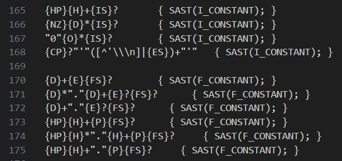
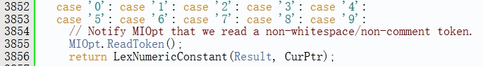

# 1. 利用clang前端让basilisk扩展到C++调研

>本调研旨在评估basilisk的词法语法的分析过程。将其与clang的词法语法分析代码进行对比，从而对basilisk的迁移进行评估。

[toc]

## 1.1. 词法分析

#### 1.1.0.1. 对数字识别的差别

basilisk中的数字识别分为float和integer，而clang中的数字识别是对所有的数字进行识别\
**basilisk:**\
\
**clang:**\
\

<!-- Gitalk 评论 start -->
<link rel="stylesheet" href="https://unpkg.com/gitalk/dist/gitalk.css">
 

     
 
<!-- Gitalk end -->

